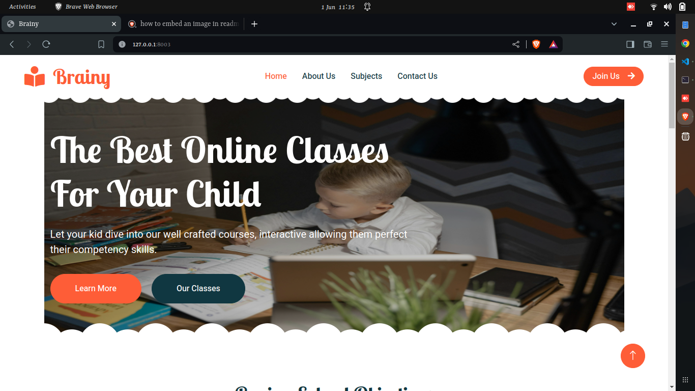

# Brainy

Brainy is a e-learning platform that allows users to lear the new competency based curriculm. The subjects in the site are developed and crafted following the KICD Curriculum Designs for each subject.


## About
The project allows each individual to take a test after reading through the well crafted topics under each lesson and subject and the graded.
To make the learning competitive the site grades each user per task and evaluates the final score giving the final score and ranking them on the leaderboard with other users.

## Development
The project is developed with Django Framework, CSS, HTML, JS and Bootsrap CSS.
The languages were chosen due to the following reasons.
- Django - Allows easy administration and posting and checking site data, also being easier to use in terms of database cause it comes with a sqlite database allowing data querying to be simpler within the app
- CSS/ Bootstrap CSS/ HTML and JS - These are used for creating dynamic UI making the site responsive and allows easier navigation while a user is moving through the site.

## Set up

**Clone the project**
```bash
git clone https://github.com/quiesscent/brainy.git
```
**Move into the folder**
```bash
cd brainy
```
*Assuming you have installed python django package, else install before running the following command*
**Run the python script**
```bash
python manage.py runserver
```
## Maintenance and Development

The projects' future update is more entirely on making the system known to the schools allowing it to be part of the curriculum such that students can better their skills in and off schools.
The projects' tasks are not automatically marked and this will be part of the future update alondside the addition of other subjects and courses alike.

## Author
- Ephesians Lewis Ochieng
